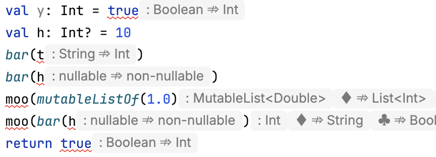

# Kotlin Mistmatch Hints

> Inlay hints succinctly describing mismatches in Kotlin code

### Available at [JetBrains Marketplace](https://plugins.jetbrains.com/plugin/26892-kotlin-mismatch-hints)

This plugin inlays information about mismatches in Kotlin code,
allowing you to know at a glance what the problem is.
At this moment, type, nullability, and variance mismatches
are recognized by this plugin.

In case of type mismatches, the type of the erroneous expression
is shown as `: Type`, and the type expected by the surrounding
context is shown afterward. If more than one potential overload
is applicable, the expected types are shown after different symbols;
the same symbol in different arguments corresponds to the same
overload.

